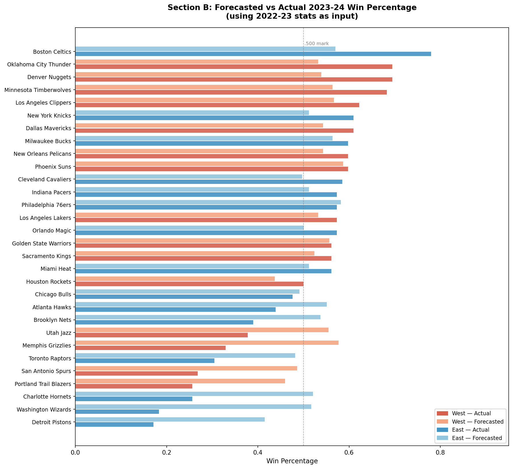

# NBA Western Conference Dominance Analysis

Python | pandas | NumPy | Data Analysis | Machine Learning | Sports Analytics

## Table of Contents

- [Project Goal](#project-goal)
- [Dataset](#dataset)
- [Project Structure](#project-structure)
- [Dataset Columns](#dataset-columns)
- [Exploratory Data Analysis](#exploratory-data-analysis)
- [Hypothesis Testing](#hypothesis-testing)
- [Predictive Modeling](#predictive-modeling)
- [Final Conclusion](#final-conclusion)
- [How to Run the Project](#how-to-run-the-project)


## Project Goal

For years, NBA fans and analysts have argued that the Western Conference has historically been stronger than the Eastern Conference. This project investigates that claim by analyzing team statistics from the 1996-97 season to the 2022-23 season and comparing performance metrics between conferences. 

The analysis will include:

- Exploratory Data Analysis (EDA) to understand distributions and trends in key statistics between conferences 
- Statistical hypothesis testing to determine whether observed differences are significant 
- Two predictive modeling approaches to forecast and explain team win percentages 


## Dataset

The dataset used for this project was sourced from Kaggle: 
[NBA Team Stats](https://www.kaggle.com/datasets/mamadoudiallo/nba-team-stats?resource=download)

The original dataset did not include a **Season** or a **Conference** column, so these were added during data preprocessing. The 2023-24 season was scraped separately and merged in during preprocessing. 

Other preprocessing steps included: 

- Creating a **Season** column
- Assigning each team to its **Conference** using a dictionary of team-conference mappings
- Handling inconsistencies in team names due to franchise name changes
- Accounting for the NBA expansion from **29 to 30 teams in 2005**
- Standardized the Los Angeles Clippers name which appeared as both the "LA Clippers" and "Los Angeles Clippers" across different seasons
- Filled missing rank columns for the 2023-24 season with null values as these were not available in the scraped data and are not used in the analysis

The dataset was preprocessed using **Python and pandas**


## Project Structure

```
nba-western-conference-analysis/

data/
    raw/               
        nba_team_stats.csv  # original Kaggle dataset
        nba_2024_scraped_.csv # scraped 2023-24 season
    processed/         
        updated_dataset.csv  # cleaned dataset used for analysis

analysis/
    exploratory_data_analysis.py             
    hypothesis_testing.py
    predictive_modeling.py

building_the_dataset/
    build_dataset.py    # script used to clean and prepare dataset
    building_23_24_dataset.py # script for webscrapping and building the 2023-24 dataset 

images/
    correlation_heatmap.png
    plus_minus_vs_win_pct.png
    point_differential_distribution.png
    win_pct_boxplot.png
    win_pct_trend_over_time.png
    section_b_predicted_vs_actual.png

README.md
.gitignore
```

## Dataset Columns:

Explanation of each column in the dataset:


| Column | Description |
|--------|-------------|
| Season | NBA season year (ex: 1996-97) |
| Conference | The team's conference (East or West) |
| TEAM_NAME | Name of the NBA team |
| GP | Games played in the season |
| W | Number of wins |
| L | Number of losses |
| W_PCT | Winning percentage (W / GP) |
| MIN | Total minutes played by the team |
| FGM | Field goals made |
| FGA | Field goals attempted |
| FG_PCT | Field goal percentage (FGM / FGA) |
| FG3M | Three-point field goals made |
| FG3A | Three-point field goals attempted |
| FG3_PCT | Three-point field goal percentage (FG3M / FG3A) |
| FTM | Free throws made |
| FTA | Free throws attempted |
| FT_PCT | Free throw percentage (FTM / FTA) |
| OREB | Offensive rebounds |
| DREB | Defensive rebounds |
| REB | Total rebounds (OREB + DREB) |
| AST | Assists |
| TOV | Turnovers |
| STL | Steals |
| BLK | Blocks |
| BLKA | Block attempts |
| PF | Personal fouls |
| PFD | Personal fouls drawn |
| PTS | Total points scored |
| PLUS_MINUS | Team's point differential (points scored minus points allowed) |
| GP_RANK | Rank of team in games played relative to other teams |
| W_RANK | Rank of team in wins relative to other teams |
| L_RANK | Rank of team in losses relative to other teams |
| W_PCT_RANK | Rank of team in winning percentage |
| MIN_RANK | Rank in total minutes played |
| FGM_RANK | Rank in field goals made |
| FGA_RANK | Rank in field goals attempted |
| FG_PCT_RANK | Rank in field goal percentage |
| FG3M_RANK | Rank in three-pointers made |
| FG3A_RANK | Rank in three-pointers attempted |
| FG3_PCT_RANK | Rank in three-point percentage |
| FTM_RANK | Rank in free throws made |
| FTA_RANK | Rank in free throws attempted |
| FT_PCT_RANK | Rank in free throw percentage |
| OREB_RANK | Rank in offensive rebounds |
| DREB_RANK | Rank in defensive rebounds |
| REB_RANK | Rank in total rebounds |
| AST_RANK | Rank in assists |
| TOV_RANK | Rank in turnovers |
| STL_RANK | Rank in steals


## Exploratory Data Analysis

Exploratory data analysis was performed to understand the distribution of team statistics and compare performance between conferences.

The key questions that were explored include:

- Do Western Conference teams have higher average win percentages?
- How has conference performance changed over time?
- Which statistics are most strongly associated with winning?

Several visualizations were created to investigate these questions.


### Win Percentage by Conference


These boxplots compare the distribution of team win percentages between the Eastern and Western Conferences. We can see that there is a small discrepancy between the boxplots, where the Western Conference teams tend to have slightly higher median win percentage, as well as higher Q1 and Q3 values.


### Average Statistics by Conference

The table below shows the average values of several key performance metrics for teams in each conference across all seasons in the dataset.

| Conference | W_PCT | PLUS_MINUS | PTS | REB | AST |
|------------|------|-----------|------|------|------|
| East | 0.483 | -0.496 | 99.70 | 42.35 | 21.95 |
| West | 0.517 | 0.490 | 102.16 | 42.85 | 22.61 |

These averages suggest that Western Conference teams tend to have slightly higher win percentages, score more points per game, and have a positive average point differential compared to Eastern Conference teams.

This initial comparison provides evidence that Western Conference teams may perform slightly better on average, motivating further statistical testing in later sections of the analysis.


### Average Conference Win Percentage Over Time


This visualization shows the average team win percentage for the Eastern and Western Conferences for each NBA season in the dataset. Across most seasons, the Western Conference maintains a higher average win percentage than the Eastern Conference, suggesting stronger overall team performance in the West. The gap is particularly noticeable during the early 2000s and mid-2010s, where Western teams consistently outperform Eastern teams.

In more recent seasons, the difference between conferences appears to narrow, indicating that the competitive balance between the two conferences may be becoming more even. In the early 2020's, the Eastern Conference has overtaken the Western Conference in win percentage, potentially suggesting that we are seeing a shift in dominance in conferences. 


### Point Differential Distribution by Conference


This histogram compares the distribution of team point differentials (PLUS_MINUS) between the Eastern and Western Conferences. Point differential measures the average margin by which a team outscores its opponents and is often considered one of the strongest indicators of overall team strength.

The distribution for Western Conference teams is slightly shifted to the right compared to the Eastern Conference, indicating that Western teams tend to have slightly higher average point differentials. This suggests that, across seasons, Western Conference teams have generally outscored their opponents by larger margins than Eastern Conference teams.


### Correlation Heatmap of Team Statistics


This heatmap visualizes the correlation between all numerical variables in the dataset. Correlation values range from -1 to 1, where values closer to 1 indicate strong positive relationships, values closer to -1 indicate strong negative relationships, and values near 0 indicate weak or no linear relationship.

Several strong relationships appear in the dataset. As expected, wins (W) and win percentage (W_PCT) show a near-perfect positive correlation. Additionally, point differential (PLUS_MINUS) has a strong positive correlation with both wins and win percentage, indicating that teams that outscore their opponents by larger margins tend to win more games.

Other offensive statistics such as points scored (PTS), assists (AST), and field goal metrics also show moderate positive correlations with winning performance.

These relationships provide insight into which team statistics are most strongly associated with success and help motivate the use of predictive models in the next stage of the analysis.


### Top Correlations with Winning

To better understand which team statistics are associated with success, correlations with win percentage (W_PCT) were examined.

The strongest positive correlations with winning include:

| Statistic | Correlation with W_PCT |
|----------|------------------------|
| PLUS_MINUS | 0.97 |
| FG_PCT | 0.56 |
| FG3_PCT | 0.46 |
| AST | 0.31 |
| DREB | 0.30 |
| PTS | 0.27 |

Among these variables, point differential (PLUS_MINUS) shows the strongest relationship with winning. This indicates that teams that outscore opponents by larger margins tend to achieve higher win percentages. Shooting efficiency metrics such as field goal percentage (FG_PCT) and three-point percentage (FG3_PCT) also show strong positive relationships with winning, suggesting that offensive efficiency is an important factor in team success. Additionally, statistics like assists and defensive rebounds show moderate correlations with winning, highlighting the importance of ball movement and defensive performance. Finally, Turnovers (TOV) show a negative correlation with win percentage, indicating that teams committing fewer turnovers tend to perform better.


### Scatter Plot of Point Differential vs Win Percentage 


This scatter plot shows the relationship between team point differential (PLUS_MINUS) and win percentage (W_PCT) across NBA teams. Each point represents a team-season, with colors distinguishing teams from the Eastern and Western Conferences. The visualization reveals a strong positive relationship between point differential and win percentage. Teams that outscore their opponents by larger margins tend  to have higher win percentages. This relationship appears consisten across both conferences, indicating that point differential is a strong indicator of team performance. While both conferences follow the same overall trend, Western Conference teams appear slightly more concentrated in the higher point differential and win percentage range (top right) in several seasons, supporting the hypothesis that the Western Conference has historically been stronger.


## Hypothesis Testing

Two-sample t-tests were conducted to determine whether observed differences between
conferences are statistically significant.

**Null hypothesis:** There is no difference in the statistic being tested between conferences.  
**Alternative hypothesis:** Western Conference teams perform significantly better than Eastern Conference teams.

| Statistic | t-statistic | p-value | Conclusion |
|-----------|-------------|---------|------------|
| W_PCT | 3.251 | 0.0006 | Western teams have a significantly higher average win percentage |
| PLUS_MINUS | 3.059 | 0.0012 | Western teams outscore opponents by significantly larger margins |
| PTS | 4.536 | 0.000003 | Western teams score significantly more points per game |
| AST | 4.036 | 0.00003 | Western teams average significantly more assists |
| REB | 3.531 | 0.0002 | Western teams average significantly more rebounds |
| FG_PCT | 5.738 | < 0.0001 | Western teams shoot significantly more efficiently |

All tested metrics showed statistically significant differences in favor of the Western Conference, providing strong evidence that the West has historically been the stronger conference over this time period.


## Predictive Modeling

Two modeling approaches were implemented, each answering a distinct question.
Three models were evaluated in both sections: Linear Regression, Random Forest, and Gradient Boosting.

Note: PLUS_MINUS was excluded from all models as a feature. Its 0.97 correlation with W_PCT would mean that the model would effectively be predicting the target using itself.


### Section A: Explaining W_PCT from Same-Season Stats

**Question:** Given a team's stats in a season, how well can we explain their win percentage?

Approach:
- Features: PTS, REB, AST, FG_PCT, FG3_PCT, TOV, STL, BLK
- Training data: all seasons from 1996-97 to 2022-23
- Test data: 2023-24 season (held out entirely)
- Evaluation: RMSE, R², and 10-fold cross-validated R²

| Model | RMSE | R² | CV R² (10-fold) |
|---|---|---|---|
| Linear Regression | 0.0755 | 0.7798 | 0.6313 |
| Random Forest | 0.1464 | 0.1711 | 0.3842 |
| Gradient Boosting | 0.1182 | 0.4594 | 0.4971 |

Best model: Linear Regression

Linear Regression outperformed both tree-based models across all three metrics. This is expected given the small dataset size of ~800 rows, and that simpler models tend to generalize better when data is limited, and the relationships between team stats and win percentage are largely linear.

The model explains 78% of the variance in win percentage (R² = 0.78) from just 8 team statistics, with an average prediction error of 7.5 percentage points. The cross-validated R² of 0.63 confirms the model generalizes well to unseen seasons.

**2023-24 Predicted vs Actual Win Percentage:**

| Team | Conference | Predicted W_PCT | Actual W_PCT |
|---|---|---|---|
| Denver Nuggets | West | 0.742 | 0.695 |
| Boston Celtics | East | 0.740 | 0.780 |
| New Orleans Pelicans | West | 0.724 | 0.598 |
| Oklahoma City Thunder | West | 0.720 | 0.695 |
| Minnesota Timberwolves | West | 0.676 | 0.683 |
| Los Angeles Clippers | West | 0.670 | 0.622 |
| Phoenix Suns | West | 0.633 | 0.598 |
| Los Angeles Lakers | West | 0.630 | 0.573 |
| Chicago Bulls | East | 0.611 | 0.476 |
| Indiana Pacers | East | 0.605 | 0.573 |
| Milwaukee Bucks | East | 0.589 | 0.598 |
| Golden State Warriors | West | 0.584 | 0.561 |
| New York Knicks | East | 0.581 | 0.610 |
| Philadelphia 76ers | East | 0.577 | 0.573 |
| Cleveland Cavaliers | East | 0.568 | 0.585 |
| Sacramento Kings | West | 0.554 | 0.561 |
| Houston Rockets | West | 0.538 | 0.500 |
| Dallas Mavericks | West | 0.531 | 0.610 |
| Miami Heat | East | 0.519 | 0.561 |
| Orlando Magic | East | 0.517 | 0.573 |
| Brooklyn Nets | East | 0.466 | 0.390 |
| Atlanta Hawks | East | 0.457 | 0.439 |
| Toronto Raptors | East | 0.448 | 0.305 |
| San Antonio Spurs | West | 0.375 | 0.268 |
| Utah Jazz | West | 0.367 | 0.378 |
| Washington Wizards | East | 0.362 | 0.183 |
| Charlotte Hornets | East | 0.352 | 0.256 |
| Detroit Pistons | East | 0.342 | 0.171 |
| Memphis Grizzlies | West | 0.292 | 0.329 |
| Portland Trail Blazers | West | 0.264 | 0.256 |

Most predictions are within 5-10 percentage points of actual. Some of the notable misses include New Orleans (predicted 0.724, actual 0.598) and Chicago (predicted 0.611, actual 0.476), both of whom underperformed their raw statistics. Dallas Mavericks was the biggest positive outlier where we predicted 0.531 but achieved 0.610, suggesting they overperformed their stats.


### Section B: Forecasting W_PCT from Previous Season Stats

**Question:** Can historical team stats predict next season's win percentage?

Approach:

Rather than using only the previous season's raw stats, the model was enhanced
with three types of features to capture each team's trajectory better:

- Last season's raw stats: PTS, REB, AST, FG_PCT, FG3_PCT, TOV, STL, BLK
- Last season's W_PCT: how good the team was overall last year
- 3-year rolling averages: smooths out outlier seasons and captures sustained team quality
- Year over year changes: whether the team is improving or declining heading into next season

This gives the model 25 features in total compared to the 8 used in Section A.

- Training data: all lagged season pairs up to 2021-22 → 2022-23
- Test data: 2022-23 stats used to predict 2023-24 W_PCT
- Evaluation: RMSE, R², and 10-fold cross-validated R²

| Model | RMSE | R² | CV R² (10-fold) |
|---|---|---|---|
| Linear Regression | 0.1495 | 0.1352 | 0.2370 |
| Random Forest | 0.1467 | 0.1679 | 0.1805 |
| Gradient Boosting | 0.1496 | 0.1345 | 0.1600 |

Best model: Random Forest

Unlike Section A where Linear Regression won, Random Forest performed best in Section B. With 25 features capturing non-linear relationships between a team's trajectory and future performance, a tree-based model is better suited to find patterns that a linear model cannot.

Feature Importances (top 10):

| Feature | Importance |
|---|---|
| PREV_W_PCT | 0.287 |
| FG_PCT | 0.244 |
| BLK_ROLL3 | 0.067 |
| FG3_PCT | 0.055 |
| TOV_ROLL3 | 0.045 |
| REB | 0.038 |
| BLK | 0.034 |
| AST | 0.027 |
| STL | 0.021 |
| STL_ROLL3 | 0.017 |

The two most important features by a significant margin are last season's win percentage (PREV_W_PCT) and field goal percentage (FG_PCT). This suggests that how good a team was overall last year, combined with their shooting efficiency, are the strongest available signals for predicting next season's success. The presence of rolling average features like BLK_ROLL3 and TOV_ROLL3 in the
top 10 confirms that multi-season trends add meaningful predictive value beyond a single season.


**2023-24 Forecasted vs Actual Win Percentage** (using multiple seasons as input):

| Team | Conference | Forecasted W_PCT | Actual W_PCT |
|---|---|---|---|
| Phoenix Suns | West | 0.587 | 0.598 |
| Philadelphia 76ers | East | 0.582 | 0.573 |
| Memphis Grizzlies | West | 0.577 | 0.329 |
| Boston Celtics | East | 0.570 | 0.780 |
| Los Angeles Clippers | West | 0.567 | 0.622 |
| Minnesota Timberwolves | West | 0.564 | 0.683 |
| Milwaukee Bucks | East | 0.564 | 0.598 |
| Golden State Warriors | West | 0.557 | 0.561 |
| Utah Jazz | West | 0.555 | 0.378 |
| Atlanta Hawks | East | 0.551 | 0.439 |
| New Orleans Pelicans | West | 0.543 | 0.598 |
| Dallas Mavericks | West | 0.543 | 0.610 |
| Denver Nuggets | West | 0.539 | 0.695 |
| Brooklyn Nets | East | 0.537 | 0.390 |
| Oklahoma City Thunder | West | 0.532 | 0.695 |
| Los Angeles Lakers | West | 0.532 | 0.573 |
| Sacramento Kings | West | 0.524 | 0.561 |
| Charlotte Hornets | East | 0.521 | 0.256 |
| Washington Wizards | East | 0.517 | 0.183 |
| New York Knicks | East | 0.512 | 0.610 |
| Indiana Pacers | East | 0.512 | 0.573 |
| Miami Heat | East | 0.512 | 0.561 |
| Orlando Magic | East | 0.501 | 0.573 |
| Cleveland Cavaliers | East | 0.497 | 0.585 |
| Chicago Bulls | East | 0.491 | 0.476 |
| San Antonio Spurs | West | 0.486 | 0.268 |
| Toronto Raptors | East | 0.482 | 0.305 |
| Portland Trail Blazers | West | 0.460 | 0.256 |
| Houston Rockets | West | 0.437 | 0.500 |
| Detroit Pistons | East | 0.415 | 0.171 |


### Section B Visualization: Forecasted vs Actual 2023-24 Win Percentage



This chart compares the forecasted and actual win percentages for all 30 NBA teams in the 2023-24 season, using multiple seasons of stats as input. Each team has two bars, where the darker bar shows the actual win percentage and the lighter bar shows the model's
forecast. Red bars represent Western Conference teams and blue bars represent Eastern Conference teams. Teams are sorted by actual win percentage, with the strongest teams at the top.

The visualization makes the model's key limitation immediately clear, the forecasted bars are tightly clustered between roughly 0.40 and 0.60, while the actual bars span the full range from 0.17 (Detroit) to 0.78 (Boston). The model correctly identifies the general tier of most mid-table teams but consistently fails to predict the extremes in either direction.

The most notable misses are visible:

- Boston Celtics: forecasted at 0.570, actual 0.780. The model had no way of
  anticipating their historic breakout season
- Oklahoma City Thunder: forecasted at 0.532, actual 0.695. A young roster
  that dramatically exceeded expectations
- Memphis Grizzlies: forecasted at 0.577 based on a strong 2022-23 season,
  but collapsed to 0.329
- Washington Wizards and Detroit Pistons: both predicted as average teams
  but finished as two of the worst teams in the league

The dashed line at 0.500 shows that the model does reasonably well at identifying which teams will finish above or below a winning record, where most teams whose actual bar crosses 0.500 also have a forecasted bar near or above it. However the magnitude
of success or failure is largely unpredictable from prior season statistics alone, which is reflected in the model's R² of 0.17.


## Final Conclusion

This project set out to investigate whether the Western Conference has historically been stronger than the Eastern Conference, using team statistics from the 1996-97 season through the 2022-23 season. The evidence across all three stages of analysis consistently supports this claim.

The exploratory data analysis revealed that Western Conference teams average a higher win percentage (0.517 vs 0.483), score more points, and maintain a positive average point differential compared to the East's negative average. These differences are visible across multiple metrics and persist across nearly three decades of data. The time-series analysis showed the West maintaining a higher average win percentage in the majority of seasons, with the gap being particularly pronounced during the early 2000s and mid-2010s.

Hypothesis testing confirmed that these observed differences are statistically significant and not due to random chance. Every metric that was tested; win percentage, point differential, assists, rebounds, and shooting efficiency; showed a significant difference in favor of the Western Conference, giving strong statistical backing to what many NBA fans have long argued anecdotally.

The predictive modeling results provided an additional layer of insight into what drives team success. Section A showed that same-season stats can explain 78% of the variance in win percentage using just 8 features, with shooting efficiency (FG_PCT) and scoring (PTS) being the strongest drivers. This is meaningful in the context of the conference comparison where Western teams consistently posted better numbers in exactly these high-impact statistics. Section B showed that forecasting future success is a fundamentally harder problem. Even with an enhanced model incorporating rolling averages, year over year changes, and prior season win percentage, the model only explained 17% of next season's variance. The dramatic misses, including Boston's historic 0.780 season, Memphis collapsing to 0.329, Oklahoma City leaping to 0.695, highlight how much of NBA team performance is shaped by factors outside of historical statistics, such as injuries, roster moves, and player development.

It is worth noting that the Western Conference's dominance does not appear to be permanent. The time-series data shows the Eastern Conference is closing the gap significantly in recent seasons and briefly overtaking the West in the early 2020s. Whether this represents a lasting shift in conference balance or a temporary period of Eastern resurgence remains to be seen, but it suggests that the gap between conferences is smaller today than it was at its peak.

Overall, the data strongly supports the claim that the Western Conference has been the historically stronger conference across the 27 seasons analyzed, but the story is more nuanced than a simple yes or no answer, and the competitive landscape of the NBA continues to evolve.


## Tools and Libraries

| Library | Purpose |
|---------|---------|
| pandas | Data manipulation and preprocessing |
| NumPy | Numerical operations |
| matplotlib | Data visualization |
| seaborn | Statistical visualizations |
| scikit-learn | Machine learning models and evaluation |

## How to Run the Project

**1. Clone the repository:**
```bash
git clone https://github.com/adamsilver2005/nba-western-conference-analysis.git
cd nba-western-conference-analysis
```

**2. Install dependencies:**
```bash
pip install -r requirements.txt
```

**3. Build the dataset:**
```bash
python building_the_dataset/build_dataset.py
python building_the_dataset/building_23_24_dataset.py
```

**4. Run the analysis scripts:**
```bash
python analysis/exploratory_data_analysis.py
python analysis/hypothesis_testing.py
python analysis/predictive_modeling.py
```

Note: The dataset building scripts in step 3 only need to be run once. After `updated_dataset.csv` has been created in `data/processed/`, you can run the analysis scripts directly without rebuilding the dataset.