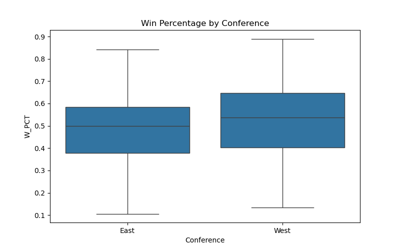
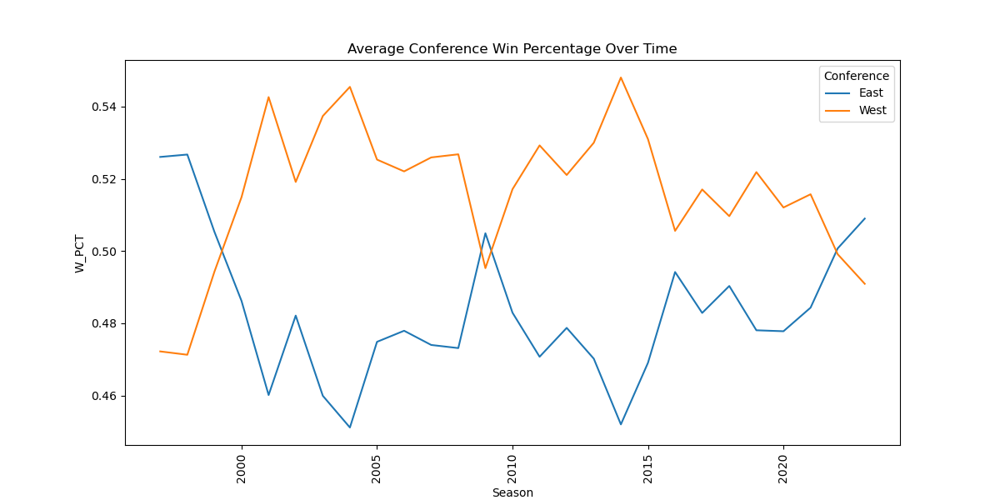
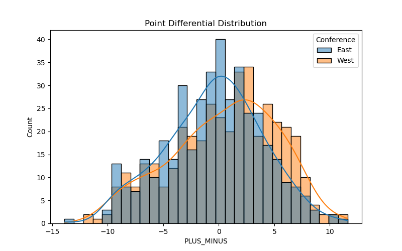
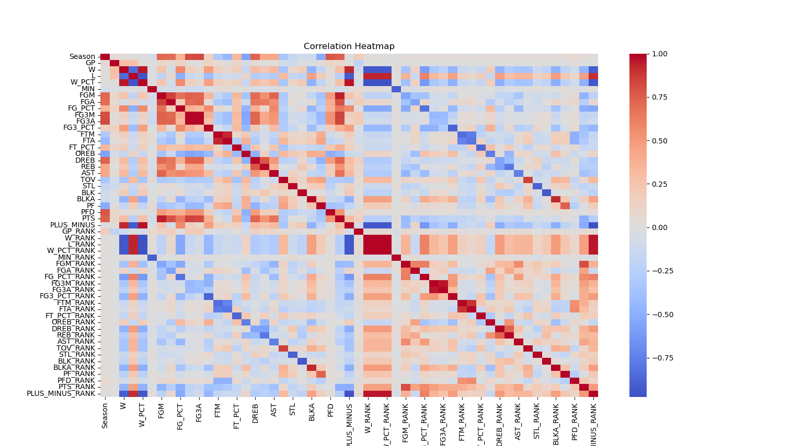
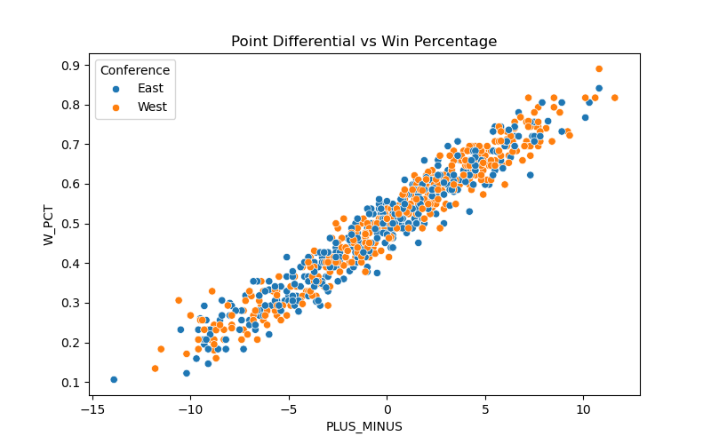

# NBA Western Conference Dominance Analysis

Python | pandas | NumPy | Data Analysis | Machine Learning | Sports Analytics

## Table of Contents

- [Project Goal](#project-goal)
- [Dataset](#dataset)
- [Project Structure](#project-structure)
- [Dataset Columns](#dataset-columns)
- [Exploratory Data Analysis](#exploratory-data-analysis)
- [How to Run the Project](#how-to-run-the-project)
- [Statistical Testing](#statistical-testing)
- [Predictive Modeling](#predictive-modeling)


## Project Goal

For years, NBA fans and analysts have argued that the Western Conference has historically been stronger than the Eastern Conference. This project investigates that claim by analyzing team statistics from the 1996-97 season to the 2022-23 season and comparing performance metrics between conferences. 

The analysis will include:

- Exploratory Data Analysis (EDA)
- Statistical comparisons between conferences
- Visualization of these comparisons over the multiple seasons
- Predictive modeling of team success


## Dataset

The dataset used for this project was sourced from Kaggle: 
(https://www.kaggle.com/datasets/mamadoudiallo/nba-team-stats?resource=download)

The original dataset did not include a **Season** or a **Conference** column, so these were added during data preprocessing. 

Other preprocessing steps included: 

- Creating a **Season** column
- Assigning each team to its **Conference** using a dictionary of team-conference mappings
- Handling inconsistencies in team names due to franchise name changes
- Accounting for the NBA expansion from **29 to 30 teams in 2005**

The dataset was preprocessed using **Python and pandas**


## Project Structure

```
nba-western-conference-analysis/

data/
    raw/                # original Kaggle dataset
        nba_team_stats.csv
    processed/          # cleaned dataset used for analysis
        updated_dataset.csv

analysis/
    exploratory_data_analysis.py              # exploratory data analysis
    hypothesis_testing.py
    predictive_modeling.py

scripts/
    build_dataset.py    # script used to clean and prepare dataset

images/
    # visualizations created during analysis

README.md
.gitignore
```

## Dataset Columns:

Explanation of each column in the dataset:


| Column | Description |
|--------|-------------|
| Season | NBA season year (ex: 1996-97) |
| Conference | The team's conference (East or West) |
| TEAM_NAME | Name of the NBA team |
| GP | Games played in the season |
| W | Number of wins |
| L | Number of losses |
| W_PCT | Winning percentage (W / GP) |
| MIN | Total minutes played by the team |
| FGM | Field goals made |
| FGA | Field goals attempted |
| FG_PCT | Field goal percentage (FGM / FGA) |
| FG3M | Three-point field goals made |
| FG3A | Three-point field goals attempted |
| FG3_PCT | Three-point field goal percentage (FG3M / FG3A) |
| FTM | Free throws made |
| FTA | Free throws attempted |
| FT_PCT | Free throw percentage (FTM / FTA) |
| OREB | Offensive rebounds |
| DREB | Defensive rebounds |
| REB | Total rebounds (OREB + DREB) |
| AST | Assists |
| TOV | Turnovers |
| STL | Steals |
| BLK | Blocks |
| BLKA | Block attempts |
| PF | Personal fouls |
| PFD | Personal fouls drawn |
| PTS | Total points scored |
| PLUS_MINUS | Team's point differential (points scored minus points allowed) |
| GP_RANK | Rank of team in games played relative to other teams |
| W_RANK | Rank of team in wins relative to other teams |
| L_RANK | Rank of team in losses relative to other teams |
| W_PCT_RANK | Rank of team in winning percentage |
| MIN_RANK | Rank in total minutes played |
| FGM_RANK | Rank in field goals made |
| FGA_RANK | Rank in field goals attempted |
| FG_PCT_RANK | Rank in field goal percentage |
| FG3M_RANK | Rank in three-pointers made |
| FG3A_RANK | Rank in three-pointers attempted |
| FG3_PCT_RANK | Rank in three-point percentage |
| FTM_RANK | Rank in free throws made |
| FTA_RANK | Rank in free throws attempted |
| FT_PCT_RANK | Rank in free throw percentage |
| OREB_RANK | Rank in offensive rebounds |
| DREB_RANK | Rank in defensive rebounds |
| REB_RANK | Rank in total rebounds |
| AST_RANK | Rank in assists |
| TOV_RANK | Rank in turnovers |
| STL_RANK | Rank in steals


## Exploratory Data Analysis

Exploratory data analysis was performed to understand the distribution of team statistics and compare performance between conferences.

The key questions that were explored include:

- Do Western Conference teams have higher average win percentages?
- How has conference performance changed over time?
- Which statistics are most strongly associated with winning?

Several visualizations were created to investigate these questions.


### Win Percentage by Conference



These boxplots compare the distribution of team win percentages between the Eastern and Western Conferences. We can see that there is a small discrepancy between the boxplots, where the Western Conference teams tend to have slightly higher median win percentage, as well as higher Q1 and Q3 values.


### Average Statistics by Conference

The table below shows the average values of several key performance metrics for teams in each conference across all seasons in the dataset.

| Conference | W_PCT | PLUS_MINUS | PTS | REB | AST |
|------------|------|-----------|------|------|------|
| East | 0.483 | -0.496 | 99.70 | 42.35 | 21.95 |
| West | 0.517 | 0.490 | 102.16 | 42.85 | 22.61 |

These averages suggest that Western Conference teams tend to have slightly higher win percentages, score more points per game, and have a positive average point differential compared to Eastern Conference teams.

This initial comparison provides evidence that Western Conference teams may perform slightly better on average, motivating further statistical testing in later sections of the analysis.


### Average Conference Win Percentage Over Time




This visualization shows the average team win percentage for the Eastern and Western Conferences for each NBA season in the dataset. Across most seasons, the Western Conference maintains a higher average win percentage than the Eastern Conference, suggesting stronger overall team performance in the West. The gap is particularly noticeable during the early 2000s and mid-2010s, where Western teams consistently outperform Eastern teams.

In more recent seasons, the difference between conferences appears to narrow, indicating that the competitive balance between the two conferences may be becoming more even. In the early 2020's, the Eastern Conference has overtaken the Western Conference in win percentage, potentially suggesting that we are seeing a shift in dominance in conferences. 


### Point Differential Distribution by Conference



This histogram compares the distribution of team point differentials (PLUS_MINUS) between the Eastern and Western Conferences. Point differential measures the average margin by which a team outscores its opponents and is often considered one of the strongest indicators of overall team strength.

The distribution for Western Conference teams is slightly shifted to the right compared to the Eastern Conference, indicating that Western teams tend to have slightly higher average point differentials. This suggests that, across seasons, Western Conference teams have generally outscored their opponents by larger margins than Eastern Conference teams.


### Correlation Heatmap of Team Statistics



This heatmap visualizes the correlation between all numerical variables in the dataset. Correlation values range from -1 to 1, where values closer to 1 indicate strong positive relationships, values closer to -1 indicate strong negative relationships, and values near 0 indicate weak or no linear relationship.

Several strong relationships appear in the dataset. As expected, wins (W) and win percentage (W_PCT) show a near-perfect positive correlation. Additionally, point differential (PLUS_MINUS) has a strong positive correlation with both wins and win percentage, indicating that teams that outscore their opponents by larger margins tend to win more games.

Other offensive statistics such as points scored (PTS), assists (AST), and field goal metrics also show moderate positive correlations with winning performance.

These relationships provide insight into which team statistics are most strongly associated with success and help motivate the use of predictive models in the next stage of the analysis.


### Top Correlations with Winning

To better understand which team statistics are associated with success, correlations with win percentage (W_PCT) were examined.

The strongest positive correlations with winning include:

| Statistic | Correlation with W_PCT |
|----------|------------------------|
| PLUS_MINUS | 0.97 |
| FG_PCT | 0.56 |
| FG3_PCT | 0.46 |
| AST | 0.31 |
| DREB | 0.30 |
| PTS | 0.27 |

Among these variables, point differential (PLUS_MINUS) shows the strongest relationship with winning. This indicates that teams that outscore opponents by larger margins tend to achieve higher win percentages. Shooting efficiency metrics such as field goal percentage (FG_PCT) and three-point percentage (FG3_PCT) also show strong positive relationships with winning, suggesting that offensive efficiency is an important factor in team success. Additionally, statistics like assists and defensive rebounds show moderate correlations with winning, highlighting the importance of ball movement and defensive performance. Finally, Turnovers (TOV) show a negative correlation with win percentage, indicating that teams committing fewer turnovers tend to perform better.


### Scatter Plot of Point Differential vs Win Percentage 



This scatter plot shows the relationship between team point differential (PLUS_MINUS) and win percentage (W_PCT) across NBA teams. Each point represents a team-season, with colors distinguishing teams from the Eastern and Western Conferences. The visualization reveals a strong positive relationship between point differential and win percentage. Teams that outscore their opponents by larger margins tend  to have higher win percentages. This relationship appears consisten across both conferences, indicating that point differential is a strong indicator of team performance. While both conferences follow the same overall trend, Western Conference teams appear slightly more concentrated in the higher point differential and win percentage range (top right) in several seasons, supporting the hypothesis that the Western Conference has historically been stronger.


## How to Run the Project

Clone the repository:

```
git clone https://github.com/YOUR_USERNAME/nba-western-conference-analysis.git
```

Install dependencies:

```
pip install -r requirements.txt
```

Run the exploratory data analysis:

```
python analysis/eda.py
```


## Tools and Libraries

- Python
- pandas
- NumPy
- matplotlib
- seaborn
- scikit-learn
